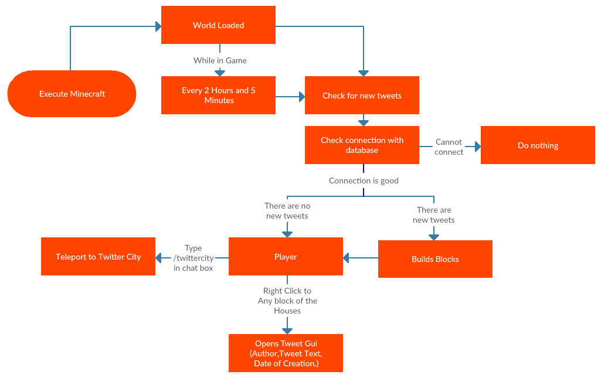
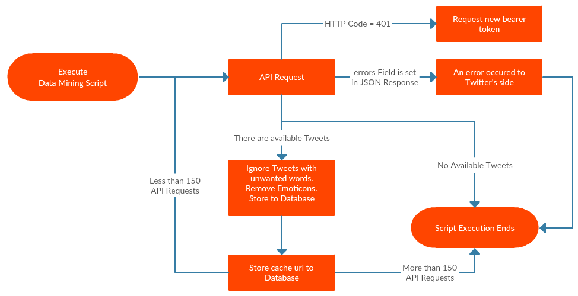
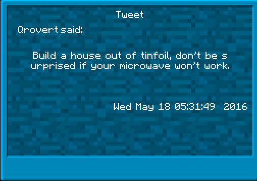
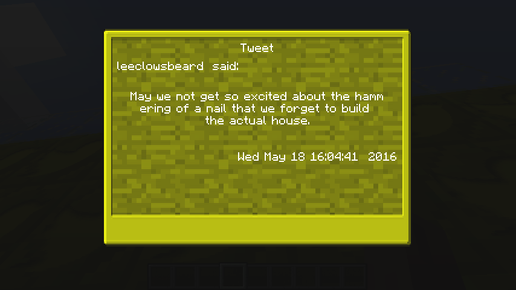
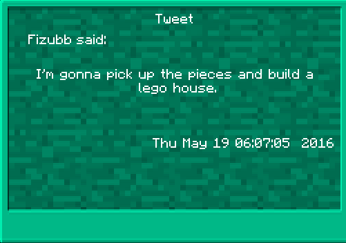
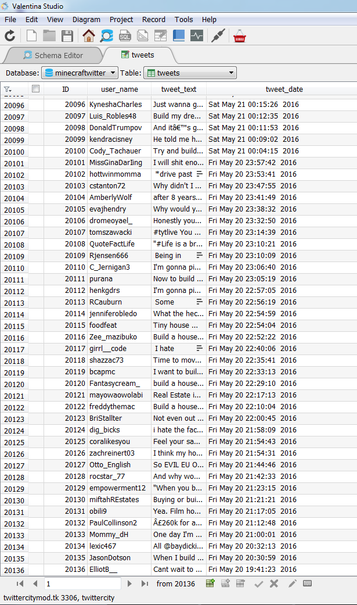
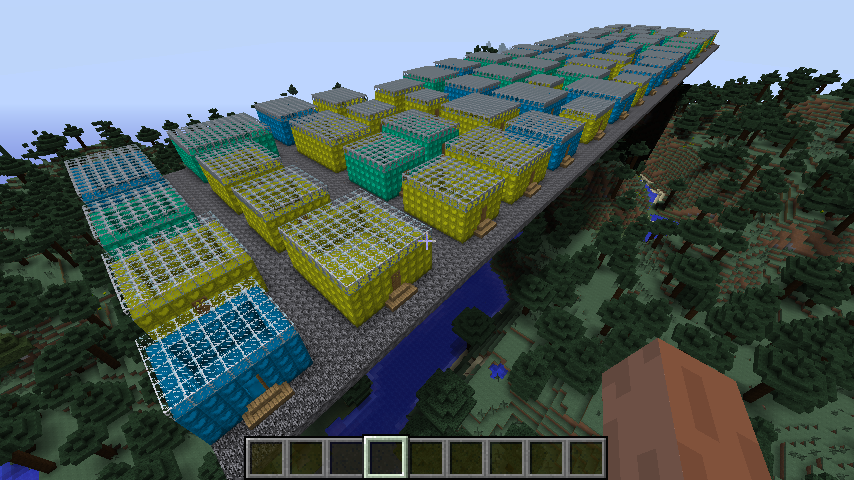

#Τίτλος Εργασίας Twitter City 

Παραδοτέο 1
Όνομα Φοιτητή: Βασίλειος Παντελής
ΑΜ: Π2011003
Θέμα Εργασίας: Twitter Visualization στο παιχίδι Minecraft (Συνέχεια εργασίας του μαθήματος Πολυμέσα).

Παραδοτέο 2

Παρουσίαση πρωτοτύπου της εφαρμογής

Η παρούσα εργασία είναι συνέχεια από το μάθημα Πολυμέσα του προηγούμενου εξαμήνου της οποίας η τελική αναφορά βρίσκετε εδώ (https://sites.google.com/a/ionio.gr/mm/projects/2016/p2011003/telike-anaphora). Περιληπτικά, η εφαρμογή κάνει Tweet mining χρησιμοποιώντας το Search API που μας παρέχει το twitter, τα αποθηκεύει σε μια MySQL database. Συνεχίζοντας την εργασία δόθηκε βάση στο τεχνικό κομμάτι, ξαναγράφοντας την από την αρχή, σχεδιαστικέ ώστε να υπάρχει η δυνατότητα να μπορεί να εγκατασταθεί σε Multiplayer Minecraft Server. Επιπλέον, διορθώθηκαν όλα τα σφάλματα που υπήρχαν στην αρχική έκδοση της εφαρμογής (π.χ Crash όταν ο χρήστης δεν είχε πρόσβαση στην βάση δεδομένων) και διαμόρφωση του project έτσι ώστε το κάθε Minecraft Client να μπορεί να συγχρονίζετε με μία βάση δεδομένων και να μην χρειάζεται για το κάθε ένα να παρέχεται ξεχωριστή βάση. Τέλος, το χτίσιμο των σπιτιών που δημιουργούνται στο Minecraft θα γίνει πιο τυχαίος (μέγεθος, texture των blocks) για την αποφυγή της μονοτονίας και του ίδιου που προκαλούσε ως τώρα.

##Tελική Αναφορά

###Σχετικά με το mod

Όνομα mod: Twitter City

Minecraft Version: 1.7.10

Mod Loader: Minecraft Forge

### Εισαγωγή

Η παρούσα εργασία είναι σύνεχεια της εργασίας που έγινε για το μάθημα ΠΟλυμέσα του 
κύριου Χωριανόπουλου της οποίας η τελική αναφορά μπορεί να βρεθεί [εδώ](https://sites.google.com/a/ionio.gr/mm/projects/2016/p2011003/telike-anaphora).

### Σύνοψη

Περιληπτικά στο μάθημα Πολυμέσα του προηγούμενου εξαμήνου δημιουργήθηκε ένα php script το οποίο σύλλεγε tweets από το Twitter τα οποία περιάχαν τις λέξεις "build house"
και για κάθε ένα tweet που συλλεγόταν χτιζόταν ένα block στο κόσμο του Minecraft. Κάθε ένα block τοποθετούνταν με τρόπο τέτοιο ώστε όταν ήταν αρκε΄τα blocks, όλα μαζί θα δημιουργούσαν ένα σπίτι.
Η κεντρική ιδέα της εργασίας παράμεινε ίδια και δόθηκε βάση πιο πολύ στο τεχνικό κομμάτι του Mod όπως επίσης και στην εμφάνιση των σπιτιών που χτίζονται. Τέλος, το mod ξαναγράφτηκε έτσι ώστε να λειτουργεί
σε multiplayer server χωρίς σφάλματα.

### Εργαλεία Ανάπτυξης

Για την ανάπτυξη της εφαρμογής χρησιμοποιήθηκαν τα εξής εργαλεία:

**Mod Loader Forge:**
 Σαν mod loader χρησιμοποίησα το Minecraft Forge το οποίο κάνει decompile το Μinecraft και σου παρέχει τον κώδικα του σαν βιβλιοθήκη. Επίσης καθιστά το mod συμβατά με τα περισσότερα mods που έχουν ανατηχθεί με το forge χωρίς περεταίρω διεργασία. Η έκδοση του minecraft για την οποία σχεδιάστηκε το mod είναι η: 1.7.10 
Το official site του forge είναι το εξής: [Minecraft Forge](http://files.minecraftforge.net/ "Minecraft Forge")

**Eclipse IDE:**
Για την συγγραφή κώδικα για το Mod που δημιουργήθηκε χρησιμοποιήθηκε το eclipse το οποίο μπορεί να βρεθεί σε αυτό το [site](https://eclipse.org/ "Eclipse IDE")

**Notepad++:**
Για τα Scripts τα οποία συλλέγει τα δεδομένα από το API του twitter και τα αποθηκεύει σε μια βάση δεδομένων χρησιμοποιήθηκε το Notepad++ που είναι διαθέσιμο σε αυτή την [ιστοσελίδα](https://notepad-plus-plus.org/download/v6.8.8.html "Notepad++").

**XAMPP:**
Με το  XAMPP εγκαθιστάτε η PHP και η βάση δεδομένων MySQL όπως επίσης και ένας WebServer. Στην γλώσσα προγραμματισμού PHP γράφτηκαν τα scripts για την εξόρυξη των δεδομένων και μέσω αυτής αποθηκεύτηκαν σε βάση δεδομένων MySQL. Επιπλέον, μου έδωσε την δυνατότητα να κάνω εκτέλεση τα scripts μέσω ενός Browser και χρησιμοποιώντας HTML να κάνω Debug. Το XAMPP μπορείτε να το κατεβάσετε από το εξής [site](https://www.apachefriends.org/index.html).

**Photoshop:**
Στο photoshop έγινε η δημιουργία των textures για το block και για το User Interface του tweet.

**Ubuntu Server LTS:**
Ως λειτουργικό σύστημα για τον Minecraft Server χρησιμοποιήθηκε το Ubuntu Server LTS το οποίο εγκαταστίθηκε σε έναν Virtual Private Server που μου παρείχε η υπερασία [Okeanos](https://okeanos.grnet.gr/home/) δωρεάν.

**PuTTy και WinSCP:**
Για την διαχείρηση του σέρβερ χρησιμοποιήθηκαν τα προγράμματα PuTTy και WinSCP. Το PuTTY μου εδώσε την δυνατότητα σύνδεσης και εκτέλεσης εντολών στο σέρβερ μέσω SSH και το WinSCP για την μεταφορά αρχείων προς τον σέρβερ. Τα παρπάνω προγράμματα μπορούν να βρεθούν στα εξής λινκς: [PuTTY](http://www.chiark.greenend.org.uk/~sgtatham/putty/download.html "PuTTY")  [WinSCP](https://winscp.net/eng/download.php "WinSCP")

### Διαδικασία Ανάπτυξης

Για την καλύτερη οργάνωση του κώδικα ξηκίνησα καινούργιο project το οποίο γράφτηκε εξ ολοκλήρου από το μηδέν με γνώμονα το κώδικα που από την εργασία του προηγούμενου εξαμήνου. Παρακάτω παρατίθονται αριθμιτικά η διαδικασία ανάπτυξης της εργασίας.

1. Σχεδίασμος της εργασίας: τι θέλουμε να πετύχουμε, να αλλάξουμε και τι χρειάζετε να προσθέσουμε.
2. Δημιουργήθηκαν proxies τα οποία χρησιμοποιούνται για να διευκρινίσουμε σε ποιά μεριά πρέπει να εκτελεστεί ο κώδικας (Server ή Client side).
3. Στην εργασία στα πολυμέσα εάν το mod δεν είχε επαφή με την βάση δεδομένων προκαλούσε το τερματισμό του παιχνιδιού με σφάλμα. Για την διόρθωση του προβλήματος σχεδιάστηκε μέθοδος η οποία πριν από την εκτέλεση κάθε ερωτήματος που χρειαζόταν για την λειτουργία του προγράμματος εκτελούσαμε ένα ελαφρή ερώτημα για να δούμε εάν πέρνουμε απάντηση απο την βάση και εμφανίζουμε κατάλληλο μύνημα λάθους.
4. Η κλάση που είναι υπεύθυνη για τον υπολογισμό τις τοποθεσίας και για το χτίσιμο των blocks υλοποιήθηκε με τρόπο ώστε να εκτελεί ερώτηματα μόνο οταν χρειάζετε καινούργιες πληροφορίες ή όταν χρειάζετε να τις αποθηκεύσει.
5. Η μεγαλύτερη αλλαγή που έγινε είναι ότι προστέθηκε συγχρονισμός των client με μια κεντρική βάση δεδομένων, αντίθετα με την εργασία του προηγούμενου εξαμήνου στον οποίο κάθε "κόσμος" του Minecraft απαιτούσε ξεχωριστή βάση δεδομένων για να λειτουργήσει σωστά. Για την επίτευξη αυτής της ιδιότητας στο save κάθε κόσμο που γίνετε τοπικά σε κάθε client αποθηκεύουμε και μια μεταβλητή με έναν ακέραιο αριθμό
ο οποίος έχει ως τιμή το ID του τελευταίου block που έχει χτιστεί επομένως όταν ελέγχουμε για καινούργια blocks που πρέπει να χτιστουν στο κόσμο μας έλεγχουμε εαν υπάρχουν δεδομένα στην βάση μας μέτα από το ID που έχει αποθηκεθτεί στον εκάστοτε κόσμο. (π.χ. Ένας κόσμος που έχει συγχρονιστεί πρόσφατα η μεταβλητή θα έχει τιμή ID = 1123 , ένας νέος κόσμος που μόλις δημιουργήθηκε αυτομάτος έχει σαν τιμή ID = 1).
6. Δημιουργήθηκαν άλλα δυο blocks για να έχουμε μεγαλήτερη ποικιλιά στο χρώμα των σπιτιών. Τα χρώματα τα οποία υπάρχουν σαν επιλογή για κάθε σπίτι είναι: μπλε, κίτρινο και πράσινο.
7. Πλέον οι διαστάσεις (μήκος, πλάτος) του σπιτιού δεν είναι στάνταρ, αντίθετα επιλέγονται τυχάιες διαστάσεις με την βοήθεια της βιβλιοθήκης Random που σου παρέχει το API της Java η οποία επιλέγει έναν αριθμό απο το 5 εώς το 10 για κάθε διάσταση. Επιπλέον, την στιγμή που "γεννιούνται" τυχαία οι διαστάσεις, επιλέγετε εξίσου τυχαία ένα απο τα χρώματα για να χτιστεί το επόμενο σπίτι.
8. Στο User Interface οι αλλαγές δεν ήταν πολλές, προστέθηκε η εμφάνιση μυνήματος λάθους σε περίπτωση που η σύνδεση με την βάση ήταν ανεπιτυχής και τέλος, προστέθηκε κώδικας για την ανάγνώριση του χρώματος του block από το οποίο ανοίχτηκε το GUI ώστε να έχει το κατάλληλο texture.
9. Προστέθηκαν σχόλια σε μορφή javadocs και στα αγγλίκα σε όλο το κώδικα εξηγόντας όσο το δυνατόν καλύτερα την λειτουργία κάθες μεθόδου και το ρόλο κάθε μεταβλητής.
10. Μετά απο έρευνα βρέθηκε το λογισμικό [Mapcrafter](https://github.com/mapcrafter/mapcrafter) το οποίο σου δίνει τη δυνατότητα να κάνεις render έναν κόσμο του Minecraft και ύστερα να μπορείς να τον δεις σε browser σε ψευτοτρισδιάστατη μορφή (Isometric View). Με την βοήθεια του δημιουργού αυτού του λογισμικού κατανόησα πως διαχειρίζετε τα blocks και κατάφερα να προσθέσω τα τρια blocks από το Mod.
11. Δημιούργησα ένα VPS μέσω της διεπαφής που σου προσφέρει η υπερεσία Okeanos και μέσω SSH εγκατέστησα java, APACHE και έκανα build το πηγαίο κώδικα του mapcrafter αφού είχα προσθέσει τα blocks.
12. Τέλος, εγκαταστήθηκε το Minecraft Server και το mod. Επιπλέον, μέσω cronjob εκτελείτε κάθε 2 ώρες το script που κάνει mine τα tweets από το twitter και κάθε 2,5 ώρες γίνετε render στο χάρτη για να προστεθούν τα καινούργια blocks. Το αποτέλεσμα του mapcrafter αποθηκεύετε απευθείας στο webserver έτσι ώστε να είναι διαθέσιμο online.
13. Για την ευκολία απομνημόνευσης των διευθήνσεων για το σιτε και για την σύνδεση στο σερβερ έκανα δωρεάν register ένα domain σε αυτό το [site](http://www.dot.tk/en/index.html?lang=en "Dot TK") και ρύθμισα το DNS να δείχνει στην IP του VPS.

*Σημείωση:* Κατα την διάρκεια κάθε βήματος και μέτα την ολοκλήρωση τους γινόταν έλεγχος για σφάλματα, τα οποία τα διόρθωνοντουσαν αμέσως. Links για το site της εργασίας, για την σύνδεση στο server και για το πηγαίο κώδικα θα παρατεθούν στο τέλος αυτής της αναφοράς. 

### Διαγράμματα Λειτουργίας

Τα διαγράμματα λειτουργίας είναι παρόμοια με του προηγούμενου εξαμήνου με μικρές διαφορές.

   

### Ενδεικτικές Οθόνες

### Συμπεράσματα

Η υλοποίηση της εργασία πρόσφερε αρκετές γνώσεις τόσο στο προγραμματιστικό κομμάτι και την οργάνωσή του όσο και στην διαχείρηση και το στήσιμο ενός σερβερ.

Παρακάτω παρατίθονται όλα τα απαραίτητα links:

Twitter City Mod Source Code: https://github.com/vpant/twittercity

Tweet Mining Script: https://github.com/vpant/dataminingscript

Ιστοσελίδα του rendered world που τρέχει στο σέρβερ: http://twittercitymod.tk/#TwitterCity/0/4/43/733/64

Ένα builded jar αρχείο του mod μπορεί να κατέβει από το εξής λινκ: http://twittercitymod.tk/TwitterCity-1.7.10-1.0.jar

Για την σύνδεση στον σερβερ στο multiplayer πατήστε Add Server και στο Server Address πληκτρολογήστε: play.twittercitymod.tk

